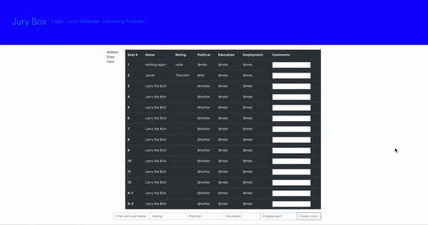

# Jury-Box

## Contributor

Randall Phillips

## User Story

As an Attorney or Law firm, I want to be able to analyze my jury pool and give them ratings so that I can dismiss problematic jurors and focus my arguments to appeal to certain personalities so that I can get the verdict my client and I want .

Usually, an attorney has to keep written notes on his/her jury pool and those sitting in “The Box”, while also adjusting opening and closing arguments to fit the psyche of the jurors, whom will ultimately decide the verdict of the case. In Mecklenburg County, a single trial can have as many as 120+ potential jurors that will cycle through the main 12 juror positions in the box. This amount of information is too much to keep track of on legal pads with messy handwriting and no charts/tables.

With The Jury Box, an attorney can record various pieces of information about every single juror, in The Box or in the Pool, and have a visual representation of who is where, and what influence they may have on the outcome of the case, and on other jurors during deliberations.

## Getting Started

You must have two terminals open to run the app locally. One must be in the Jury-Box/frontend directory, while the 2nd must be in the Jury-Box/server/src folder.

In the frontend terminal, use
yarn run relay  
to load in the schema from graphql to the frontend.

Next, still in the jury-box-frontend terminal, use
yarn run start  
 to have the app open on port 3000. This will load in the React App and front end UI.

Then, in your second terminal, use node index.js to start up your server. This is connected to an Atlas Cloud Cluster and will read
DB OK  
 at the bottom of the terminal.

## Technologies Used

Create React App
GraphQL
MongoDB
Passport JS
Node JS
Bootstrap-4

## Deployed

February 4th, 2020.

## App & Repo

Github: https://github.com/rphill26/Jury-Box

Heroku: https://whispering-retreat-88312.herokuapp.com/

## Working Image

## License

MIT
